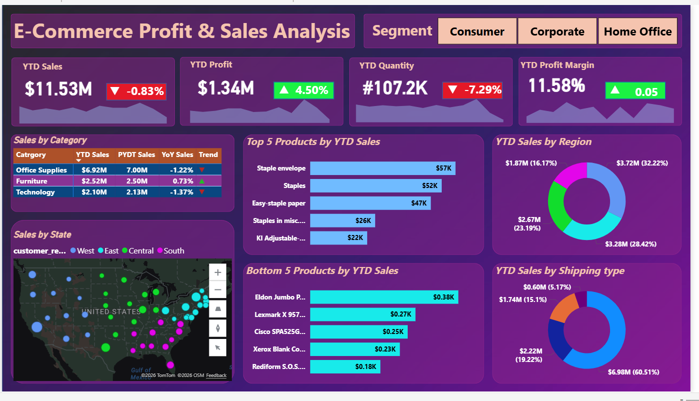

# E-Commerce Profit & Sales Analysis Dashboard (Power BI)


## Project Overview

I developed this **E-Commerce Profit & Sales Analysis Dashboard** using Microsoft Power BI to deliver a comprehensive, real-time view of sales performance, profitability, product trends, and regional performance for an e-commerce retail business.

The dashboard transforms complex transactional data into clear, interactive, and visually compelling insights, empowering stakeholders to monitor key metrics and make informed, data-driven business decisions.

## Key Insights

- **YTD Sales**: **$11.53 Million**
- **YTD Profit**: **$1.34 Million**
- **YTD Quantity Sold**: **107.2K units**
- **YTD Profit Margin**: **11.58%**

## Business Highlights

- Strong overall profitability with a healthy **11.58%** profit margin
- Office Supplies dominates sales with **$6.92M** YTD
- Consumer segment is the primary revenue driver
- Consistent performance across major regions (West, East, Central, South)
- Top-performing products include Staple Envelope, Staples, and Easy-Staple Paper

## Dashboard Features

### Sales Overview
- Real-time YTD KPIs with trend indicators
- Sales, Profit, Quantity, and Profit Margin trend lines

### Product Performance
- Sales breakdown by Category (Office Supplies, Furniture, Technology)
- Top 5 and Bottom 5 products by YTD Sales

### Regional & Geographic Analysis
- YTD Sales by Region with percentage contribution
- Interactive US map showing sales distribution by state

### Operational Analysis
- Sales distribution by Shipping Type
- Segment-wise performance (Consumer, Corporate, Home Office)

## Tools & Techniques Used

- **Microsoft Power BI Desktop & Power BI Service**
- Advanced **DAX Measures**
- **Power Query** for data cleaning and transformation
- Professional data modeling and relationships
- Modern visualizations (Bar, Donut, Map, KPI cards)

## Interactive Features

- Dynamic filtering by Segment, Region, Category, etc.
- Cross-filtering and drill-down capabilities
- Responsive design

## Dashboard Preview 




## Project Structure
```
Ecommerce_Sales_Analysis/
├── data/
│   ├── ecommerce_data.csv
│   └── us_state_long_lat_codes.csv
├── Ecommerce_Profit_Sales_Analysis_Dashboard.pbix
├── README.md
└── Screenshot.png                                       # Project Documentation (You are here)
```

## How to Use

1. Download the `.pbix` file
2. Open it using **Power BI Desktop**
3. Interact with slicers (especially Segment) and visuals to explore different insights
4. Publish to Power BI Service for sharing with stakeholders

## Skills Demonstrated

- End-to-End Power BI Dashboard Development
- Advanced DAX and Business Logic Implementation
- Data Modeling & ETL Processes
- Business Intelligence & Performance Analytics

## Final Thoughts

This Power BI dashboard provides a professional, modern, and highly interactive experience for monitoring e-commerce performance. It successfully converts raw sales data into actionable intelligence, helping identify growth opportunities, optimize operations, and boost profitability.

Feel free to give this project a ⭐ if you find it useful!

Any feedback or suggestions are always welcome.

## Connect with me

- **LinkedIn**: [Patro Ramu](https://linkedin.com/in/yourprofile)
- **GitHub**: [ramupathro07](https://github.com/ramupathro07)

---

**Made with ❤️ using Power BI**

